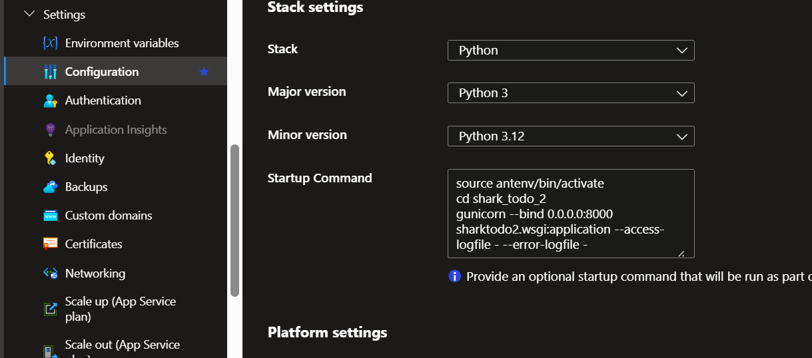

this page contain proper account of deploying A Django project on Azure web service manually without CI/CD pipeline.

- Keep this private it contain secret environment variables;
- we are assuming here that you create Django project with best practices
    - You Django Project is a Repository of GitHub if not make it
    - You install all the python packages required for your project in a virtual environment. If not do it.
    - 

## Configure Django Project For Deployment

---

### Install additional packages for deployment

- I am assuming here that you already create a virtual environment and install all the package which are required for your Django app to run on the same.
- Install below packages on the same virtual environment

```python
pip install psycopg2
pip install python-dotenv
pip install whitenoise

```

### write deployment settings

- Create a [deployment.py](http://deployment.py/) file on the directory [settings.py](http://settings.py/) present
- this file will treated as settings file in deployment environment
- copy and page the below code on that. change if needed.

```python
import os
from .settings import *
from .settings import BASE_DIR

SECRET_KEY = os.environ['SECRET']
ALLOWED_HOSTS = [os.environ['WEBSITE_HOSTNAME']]
CSRF_TRUSTED_ORIGINS = ['https://' + os.environ['WEBSITE_HOSTNAME']]
DEBUG = False

# WhiteNoise configuration
MIDDLEWARE = [
    'django.middleware.security.SecurityMiddleware',
    'whitenoise.middleware.WhiteNoiseMiddleware',
    'django.contrib.sessions.middleware.SessionMiddleware',
    'django.middleware.common.CommonMiddleware',
    'django.middleware.csrf.CsrfViewMiddleware',
    'django.contrib.auth.middleware.AuthenticationMiddleware',
    'django.contrib.messages.middleware.MessageMiddleware',
    'django.middleware.clickjacking.XFrameOptionsMiddleware',
]

STATICFILES_STORAGE = 'whitenoise.storage.CompressedManifestStaticFilesStorage'
STATIC_ROOT = os.path.join(BASE_DIR, 'staticfiles')

'''
# a way to add database connection
conn_str = os.environ['AZURE_POSTGRESQL_CONNECTIONSTRING']
conn_str_params = {pair.split('=')[0]: pair.split('=')[1] for pair in conn_str.split(' ')}
DATABASES = {
    'default': {
        'ENGINE': 'django.db.backends.postgresql',
        'NAME': conn_str_params['dbname'],
        'HOST': conn_str_params['host'],
        'USER': conn_str_params['user'],
        'PASSWORD': conn_str_params['password'],
    }
}
'''

```

### tell our app when to use deployment settings

- we need to change [wsgi.py](http://wsgi.py/) (present in same dir as [settings.py](http://settings.py/) in)
- copy pate the below code on the, don’t forget to change the `project_name`

```python
import os
from django.core.wsgi import get_wsgi_application

project_name = "my-project-name"

settings_module = '.deployment' if 'WEBSITE_HOSTNAME' in os.environ else '.settings'

os.environ.setdefault('DJANGO_SETTINGS_MODULE', project_name+settings_module)

application = get_wsgi_application()

```

### create requirements.txt

- caution: make sure virtual environment activate, and CMD is on the root directory of project (same on which [manage.py](http://manage.py/) present)
- run the below command on CMD to create a requirements.txt

```python
pip freeze > requirements.txt

```

### Add a .production and .gitignore file

- add a .production file in same directory as [manage.py](http://manage.py/) in with below code.

```python
[config]
SCM_DO_BUILD_DURING_DEPLOYMENT=true

```

- add a .gitignore file in same dir as [manage.py](http://manage.py/) in with below code.

```python
# Byte-compiled / optimized / DLL files
__pycache__/
*.py[cod]
*$py.class

# Distribution / packaging
.Python
build/
develop-eggs/
dist/
downloads/
eggs/
.eggs/
lib/
lib64/
parts/
sdist/
var/
wheels/
pip-wheel-metadata/
share/python-wheels/
*.egg-info/
.installed.cfg
*.egg
MANIFEST

# PyInstaller
#  Usually these files are written by a python script from a template
#  before PyInstaller builds the exe, so as to inject date/other infos into it.
*.manifest
*.spec

# Installer logs
pip-log.txt
pip-delete-this-directory.txt

# Unit test / coverage reports
htmlcov/
.tox/
.nox/
.coverage
.coverage.*
.cache
nosetests.xml
coverage.xml
*.cover
*.py,cover
.hypothesis/
.pytest_cache/

# Django stuff:
*.log
local_settings.py
db.sqlite3
db.sqlite3-journal

# PEP 582; used by e.g. github.com/David-OConnor/pyflow
__pypackages__/

# Environments
.env
.venv
env/
venv/
ENV/
env.bak/
venv.bak/

```

<aside>
💡 All done now your Django project is configured for Deployment, Commit and Push it to GitHub.

</aside>

## Create and Configure Azure resources

### Create a App service on Azure

- with Python as a run-time environment. same version as you build your Django app on local machine

### Set all necessary environment variables on azure service

you can use the JSON format for doing it faster

```json
[
  {
    "name": "WEBSITE_HTTPLOGGING_RETENTION_DAYS",
    "value": "1",
    "slotSetting": false
  },
  
]

```

## Deploying Project Manually without CI/CD pipeline

---

### Make app service Authentication for GitHub with SSH key

1. Generate SSH-key with Azure App Service SSH
    
    ```bash
    ssh-keygen -t rsa -b 4096 -C "jk69854@gmail.com"
    
    ```
    
    ```bash
    cat ~/.ssh/id-rsa.pub
    
    ```
    
2. Set this SSH-key in GitHub with GUI
    
    <aside>
    💡 ‣ | https://github.com/settings/keys
    
    </aside>
    
    above is the direct link for that same site, better to save with the name of App-service
    
3. Verify Connection
    
    ```bash
    ssh -T git@github.com
    
    ```
    

### Clone the Project Repo and Build it

1. Install git in App service
    
    ```bash
    apt install git
    
    ```
    
2. clone the repo
    
    ```bash
    cd ~/home/site/wwwroot/ # more to deployment directory
    git clone <ssh-url-of-repo> # remember ssh url and http url
    
    ```
    
3. Build it
    
    here the the build command either you can do it by yourself or just copy past below instruction in chat-gpt by putting your `repo-name` and `github-username` on top line and GPT will do give a handy command file for you that you can copy past directly on app-service SSH
    
    ```bash
    # my repo name is [pur-repo-name-here] my github username is [github-username]
    # re write all these command for me so that I can copy page these in my azure app service cli directly
    cd ~/home/site/wwwroot/ # more to deployment directory
    cd <repo-name> # move into the project
    git checkout <branch-name> # switch to branch you want to deploy
    cd .. # go back
    python -m venv antenv # create python virtual environment with name antenv
    source antenv/bin/activate # activate the virtual environment
    pip install -r <repo-name>/requirements.txt # install the requirement of your django project
    pip install gunicorn # might be gunicorn not in the requirements
    cd <repo-name> # again to into the repo directory
    py manage.py migrate # migrate the migrations
    py manage.py collectstatic --noinput # collect all the static files
    
    ```
    

### Test if things done correctly or not

1. Open two window of app-service SSH and navigate to repo directory on both.
    
    ```bash
    cd ~/home/site/wwwroot/my-repo/ # same file where manage.py is present
    
    ```
    
2. test server is running properly with | python [manage.py](http://manage.py/) runserver
    
    ```bash
    # on SSH window 1
    py manage.py runserver 1010 # run the runsever on port 1010 as might be 8000 already busy
    # TIP: you can also see in this ouput which setting is working s dettings.py or deployment.py
    
    # on SSH window 2 while server is continuously running on window 1
    curl <http://localhost:1010/> # lisen to the loclhost port 1010
    # if it give no output --> good test passed
    # if it give some html context which show erro code 400 --> test failed something is wrong
    # if it give some html context which do not contain error --> text passed
    
    # now u can stop the server at window 1 by crt+C
    
    ```
    
3. test by running `gunicorn` server
    
    ```bash
    # on SSH window 1
    gunicorn --bind 0.0.0.0:1010 sharktodo2.wsgi:application --access-logfile - --error-logfile - # run the runsever on port 1010 as might be 8000 already busy
    
    # on SSH window 2 while server is continuously running on window 1
    curl <http://localhost:1010/> # lisen to the loclhost port 1010
    # if it give no output --> good test passed
    # if it give some html context which show erro code 400 --> test failed something is wrong
    # if it give some html context which do not contain error --> text passed
    
    # now u can stop the server at window 1 by crt+C
    
    ```
    

### Tell app-service to run your Django app on hosting port (8000) not default one.

navigate to app service configuration and set give start-up command there and save it.

just wait for max 5 min and visit your app service URL your Django app will be live there



```bash
source antenv/bing/activate
cd [your-repo-name]
gunicorn --bind 0.0.0.0:8000 sharktodo2.wsgi:application --access-logfile - --error-logfile -

```

### Some Debugging Tips

1. you can check Log of of from the app-service sidebar Log Stream
    1. and even you can turn more detailed log from app-service side-bar app-service-logs
2. have doubt my [deployment.py](http://deployment.py/) settings are running or not
    1. just run python [manage.py](http://manage.py/) runserver from the ssh it will show which setting are running